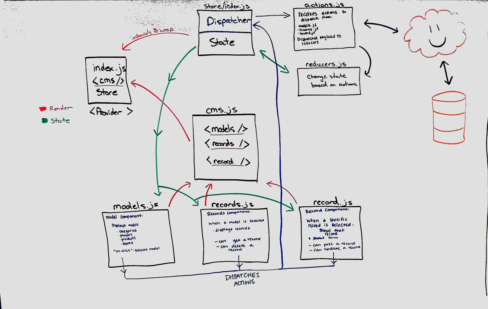
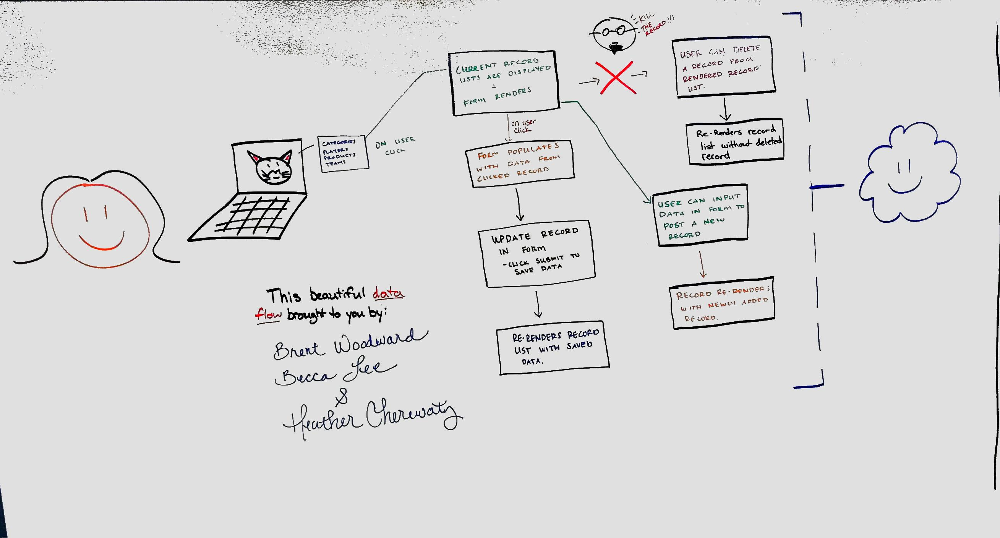

 LAB
=================================================

## CMS

### Author: Heather Cherewaty

#### Collaborated with:  Becca Lee, Hannah Ingham, and Brent Woodward

### Links and Resources
* [repo](https://github.com/hcherewaty/35-project-cms)
* [travis]()
* [front-end](https://d1x4e9e2dcnr90.cloudfront.net/)

### Modules
#### `modulename.js`
##### Exported Values and Methods

#### Running the app
* `npm start`

#### Tests
* How do you run tests?
* What assertions were made?
* What assertions need to be / should be made?

#### UML

